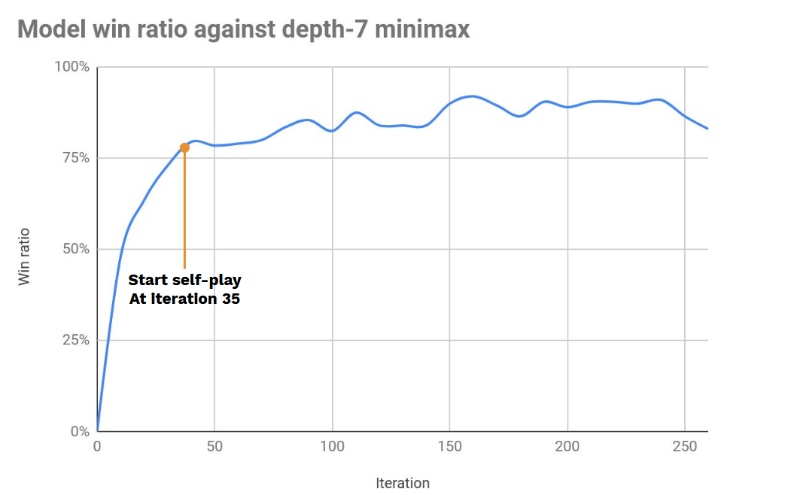

# CU Makhos

Implementation reinforcement learning for Thai Checkers based on the AlphaGo methods (supervised + reinforcement) since I failed to implement zero knowledge model in the first run (probably some hyperparameters issues since RL is prone to such thing).

The implementation uses Python and Pytorch. It is based on [alpha-zero-general](https://github.com/suragnair/alpha-zero-general) framework so you can easily implement other variants of checkers.

If you plan to train your model or improve the bundled one look at `main_th_checkers.py`

### How to play

To play against model you need Python and CUDA installed.

```
python human_ui.py
```

### Pretrained model

Latest iteration of my run is 268, where the first 35 iterations learned from minimax algorithm gameplay and the rest are self-play of the latest iteration at the time.



The performance of the model was estimated as a total result in 200-games match against depth-7 minimax algorithm using 200 simulations Monte Carlo tree search each move.

Model search is about 10 times efficiency compare to depth-7 minimax in terms of move simulations.

### Thanks to

- [alpha-zero-general](https://github.com/suragnair/alpha-zero-general)
- [chess-alpha-zero](https://github.com/Zeta36/chess-alpha-zero)
- [pytorch-classification](https://github.com/bearpaw/pytorch-classification) and [progress](https://github.com/verigak/progress).
- [alpha-nagibator](https://github.com/evg-tyurin/alpha-nagibator)
